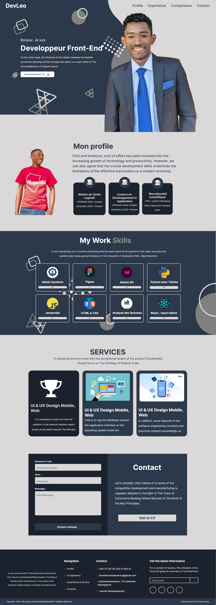
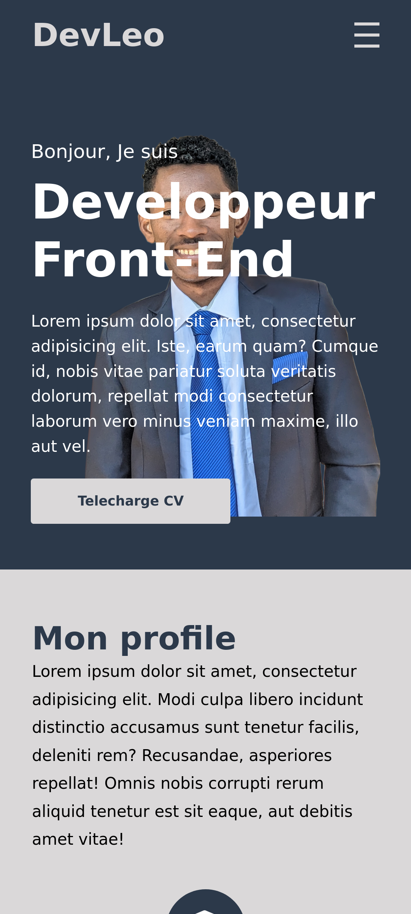

## Rapport de Projet : Conception d’un Portfolio Responsive Avec HTMl & CSS

### Objectif du projet

L’objectif principal était de concevoir un portfolio professionnel mettant en valeur mon parcours, mes compétences et mes expériences et mes services en tant que développeur Front-End. Ce projet présente mon profil tout en offrant une expérience utilisateur optimale sur tous les appareils grâce à un design responsive.

## Présentation

Ce portfolio a été conçu pour mettre en avant mon parcours, mes compétences techniques et mes réalisations. Il permet aux visiteurs de découvrir mon profil, de consulter mon CV et de me contacter facilement.

## Fonctionnalités

- **Navigation claire** : Accès rapide aux sections Profil, Compétences, Expérience et Contact.
- **Présentation du profil** : Informations sur mon parcours académique et professionnel.
- **Compétences** : Liste de mes compétences principales (HTML, CSS, JavaScript, React, Python, UI/UX, etc.).
- **Services** : Description des services proposés (UI/UX Design, Développement Web, Desktop & Mobile).
- **Formulaire de contact** : Permet d’envoyer un message directement depuis le site.
- **Footer** : Informations de contact, liens de navigation et réseaux sociaux.


### Outils et technologies utilisés

- **HTML5** : Structure sémantique des pages.
- **CSS3** : Mise en forme, animations et adaptation responsive via les media queries.
- **Lunacy** : Création des maquettes UI/UX, prototypage et exportation des assets graphiques.
- **Responsive Design** : Utilisation de Flexbox et Grid pour garantir une compatibilité mobile, tablette et desktop.

## Structure du projet

```
    /README.md
    /src/
        /index.html
        /style.css
        /script.js
    /image/
```

### Étapes de conception



<span>Image de maquettes UI/UX</span>

1. **Analyse des besoins** : Identification des sections essentielles (profil, compétences, services, contact).
2. **Conception UI/UX avec Lunacy** :

    - Réalisation de wireframes et prototypes interactifs.
    - Sélection d’une palette de couleurs harmonieuse et de typographies modernes.
    - Création d’icônes et d’illustrations personnalisées.

3. **Développement HTML/CSS** :

    - Intégration fidèle des maquettes.
    - Mise en place d’une navigation intuitive.
    - Application des principes de responsive design pour une expérience fluide sur tous les écrans.

4. **Tests et optimisation** :

    - Vérification de la compatibilité sur différents navigateurs et appareils.
    - Optimisation des images et du code pour améliorer les performances.

### Résultats obtenus

- Un portfolio moderne, esthétique et facile à utiliser.
- Une interface utilisateur cohérente et agréable, conforme aux maquettes réalisées sous Lunacy.
- Un site entièrement responsive, accessible sur mobile, tablette et ordinateur.
- Un temps de chargement optimisé et une navigation fluide.



<span>Image Resultat code source avec HTML & CSS </span>


### Conclusion

Ce projet m’a permis de renforcer mes compétences en HTML, CSS et design UI/UX avec Lunacy. Le résultat est un portfolio professionnel, évolutif et adapté aux standards actuels du web.
